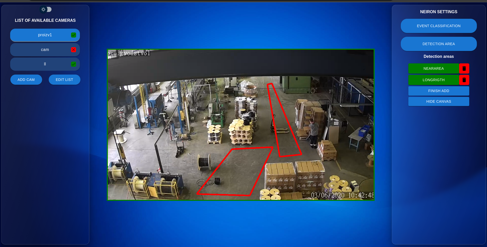

# hackaton0922

## Результаты




## Участники
[Валерий Ржевский](https://github.com/Valetron)
[Глеб Харитонов](https://github.com/Ser1ousSAM)
[Денис Жиров](https://github.com/myaak)

## Frontend
### Сборка фронта
#### Установка зависимостей
Установить *npm*, *node.js*.
#### Сборка проекта
1. Переходим в папку front
2. Ввести
```
npm install
npm start
```
3. Запустится проект в основном браузере на http://localhost:3000 (default).

## Neural network
### Зависимости
* opencv >= 4.5.2
* nlohmann_json >= 3.10.5
* conan (для сборки)
* cmake >= 3.10

### Установка
1. Перейти в папку NN и создать папку *build*
```bash
mkdir -p NN/build && cd NN
```
2. Запустить установку зависимостей
```bash
pip3 install conan
source ~/.bashrc && source ~/.bash_profile
conan install conanfile.txt --build=missing -if cmake -s compiler.libcxx=libstdc++11
cd build
cmake ..
cmake --build .
```

